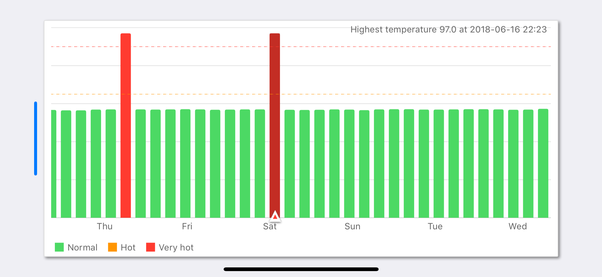
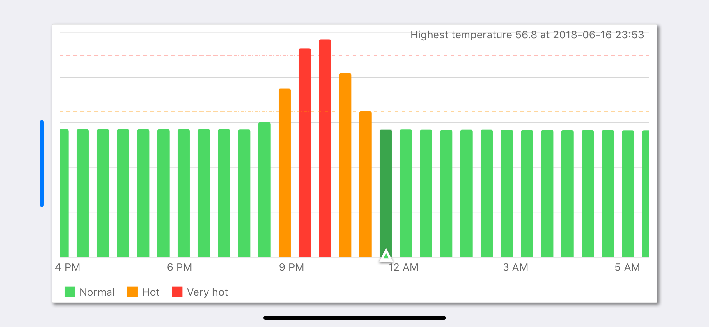

# Charts Addons
The library extends basic Bar chart of [Charts](https://github.com/danielgindi/Charts) framework.

The extention of bar chart visually aggregates overlapped bars under single bar of extreme values (min/max or median) of them, e.g. for discrete data, like temperature, on timeline, it usefull to show the bars with constant width, and to aggregate them if they overlap each other.

## Usage

The framework extends Charts framework, so it is mainly inherits API of the [Charts](https://github.com/danielgindi/Charts).
To add the framework into your project:
1) add Charts framework into you project, please follow instruction on [Charts](https://github.com/danielgindi/Charts)
2) add Carts_Addons.framework for you target in "Linked Frameworks and Libraries" 

For slightly customization you can change attributes of AggregatedBarChartView: 
### -**groupWidth** - to specify bar width
### -**groupMargin**  -  to specify margin betwen bar
### -**barBorderRoundedCorner** - to specify rounding for corners 

Protocol AggregatedBarChartViewMarkerPositionDelegate provides interface to get position of the marker according to the selected bar.
### -**func getMarkerPosition(highlight: Highlight) -> CGPoint**

Example of using you can find at **Charts_Addons_Demo** project.

## Screenshots

- **Timeline presents 7 days period**

- **Scaled timeline to presents 1 day period**

## License

This project is licensed under the terms of the [MIT license](https://github.com/MaximKomlev/Charts_Addons/blob/master/LICENSE).
